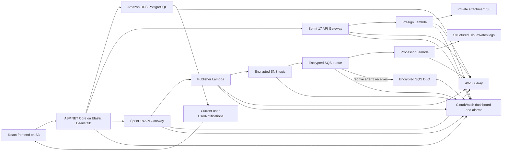

# PropCare Cloud Task 2 Architecture

## 1. Purpose

Task 2 extends the completed Task 1 cloud application with serverless and event-driven AWS components. The existing S3 frontend, Elastic Beanstalk ASP.NET Core API, and Amazon RDS PostgreSQL database remain the core system, while Task 2 adds an attachment upload and notification architecture around it.

## 2. Task 1 Previous Architecture

Task 1 uses a three-tier cloud architecture:

- Existing Task 1 component: React and Vite frontend hosted by Amazon S3 static website hosting.
- Existing Task 1 component: ASP.NET Core Web API hosted on AWS Elastic Beanstalk.
- Existing Task 1 component: Entity Framework Core data access layer.
- Existing Task 1 component: Amazon RDS PostgreSQL database for application data.
- Existing Task 1 component: JWT authentication, backend role-based access control, and tenant data isolation.

The browser loads the frontend from S3, the frontend calls the Elastic Beanstalk API, the API enforces authentication and business rules, and EF Core persists data to RDS PostgreSQL.

## 3. Task 2 Architecture

Task 2 keeps the existing Task 1 core path active:

- Existing Task 1 component: User browser.
- Existing Task 1 component: React frontend on S3.
- Existing Task 1 component: Elastic Beanstalk ASP.NET Core API.
- Existing Task 1 component: Amazon RDS PostgreSQL.

Sprint 17 adds a serverless attachment microservice:

- New Task 2 component: Amazon API Gateway REST API.
- New Task 2 component: Python 3.12 AWS Lambda authorization service.
- New Task 2 component: Private Amazon S3 attachment bucket.
- Existing backend-to-API Gateway calls protected by a backend-only API key and usage plan.
- Presigned POST upload policies limited to approved content types, a 10 MB maximum, and five-minute expiry.

Sprint 18 adds a separate asynchronous notification stack:

- New backend-only API Gateway route and publisher Lambda.
- Encrypted Amazon SNS topic.
- Encrypted Amazon SQS queue with an encrypted dead-letter queue and redrive policy.
- Processor Lambda with partial batch failure support.
- Structured Lambda runtime logs retained for 14 days.

Sprint 19 adds:

- `UserNotification` records in the existing RDS database for a minimal authenticated inbox.
- A top-bar bell that reads only the signed-in user's notifications through the backend.
- A separate CloudWatch dashboard and focused alarms across the serverless and Task 1 runtime.
- Native X-Ray tracing on the Sprint 17/18 API Gateway stages and Lambda functions.

The existing backend remains the security boundary. It validates JWT identity, role permissions, maintenance request access, and tenant isolation before calling the serverless attachment service.

## 4. Architecture Change Summary

| Area | Task 1 | Task 2 Extension | Reason |
| --- | --- | --- | --- |
| Application architecture | S3 frontend, Elastic Beanstalk API, RDS PostgreSQL | Adds API Gateway and Lambda for attachment URL generation | Keeps the core app stable while adding focused serverless capability |
| File storage | Business data stored in RDS | Attachment objects stored in private S3 | Avoids storing large binary files in the relational database |
| Processing model | Server-based ASP.NET Core request handling | Event-driven upload and notification path | Improves scalability for file upload workflows |
| Communication | Frontend calls backend API | Backend calls API Gateway; browser uploads directly to private S3 | Keeps user authorization in the backend and removes file transfer load from Elastic Beanstalk |
| Reliability | Elastic Beanstalk and RDS support the main workflow | SQS retains events if notification processing is delayed | Attachment events do not block the core maintenance workflow |
| Monitoring | Application logs and deployment health | CloudWatch metrics plus X-Ray traces for serverless flow | Improves visibility across the added AWS services |
| Security | JWT, RBAC, tenant isolation, RDS security groups | Private S3, short-lived presigned URLs, least-privilege Lambda IAM | Adds file upload capability without exposing AWS credentials |

## 5. Attachment Upload Data Flow

1. User selects a file for a maintenance request.
2. Frontend sends the upload request to the existing ASP.NET Core backend.
3. Backend validates JWT, role, request access, and tenant isolation.
4. Backend calls API Gateway.
5. API Gateway invokes Lambda.
6. Lambda returns a five-minute presigned POST with an exact object key, content type, encryption field, and size policy.
7. Frontend uploads directly to private S3 without AWS credentials.
8. Frontend asks the backend to confirm the upload.
9. Backend authorizes the request again and asks Lambda to verify the S3 object metadata.
10. Backend stores only file metadata and the private object key in RDS PostgreSQL.
11. Authorized users list metadata through the backend.
12. Backend requests a five-minute presigned GET from Lambda for authorized downloads.

Sprint 18 adds notification publishing after attachment metadata persistence without changing this Sprint 17 upload flow.

## 6. Notification Event Flow

1. The backend commits the maintenance creation, assignment, status, or attachment operation.
2. It creates a safe version `1.0` event with generated event and correlation IDs.
3. The backend calls `POST /notifications/publish` with a backend-only API key.
4. Publisher Lambda validates the allowlisted contract and publishes to encrypted SNS.
5. SNS delivers the raw event to encrypted SQS.
6. Processor Lambda validates each message again and records a safe structured processing result.
7. Successful messages are removed; repeated failures are redriven to the encrypted DLQ after three receives.
8. A notification dispatch failure never rolls back the committed business operation.

Sprint 19 extends this flow by storing one `UserNotification` row per valid recipient before publishing the same event. Inbox storage and publishing share the same event and correlation IDs, remain non-blocking after the business commit, and never grant Lambda direct RDS access.

## 7. Security Design

- Existing backend remains the authentication and RBAC boundary.
- The frontend must never contain AWS credentials.
- S3 attachment bucket remains private.
- S3 Block Public Access remains enabled.
- Upload and download authorizations expire after five minutes.
- File type and size are validated before upload authorization.
- Lambda IAM role uses least privilege for presigned URL generation.
- Lambda object access is restricted to the attachment prefix; `s3:ListBucket` is additionally constrained to `maintenance-requests/*` so missing objects can be reported safely.
- API Gateway requires a backend-only API key, usage plan, and throttling on all three routes.
- API Gateway is service-level protection; JWT identity and role authorization remain in ASP.NET Core.
- The API key is generated by API Gateway and stored only in Elastic Beanstalk environment configuration.
- Secrets are never committed.
- RDS is not accessed directly by Lambda.
- Existing tenant isolation remains enforced before generating an upload URL.
- S3 object keys use the maintenance request ID, a generated UUID, and a sanitized file name.
- S3 Block Public Access, bucket-owner enforcement, and SSE-S3 encryption are enabled.
- S3 CORS permits only the deployed frontend and local development origins.
- Attachment bytes never pass through Elastic Beanstalk or RDS.
- The Sprint 18 API key is stored only in Elastic Beanstalk and is never sent to the browser.
- Publisher Lambda can publish only to the Sprint 18 SNS topic and has no S3, SQS, or RDS access.
- Processor Lambda can consume only the Sprint 18 primary queue and has no S3, SNS, or RDS access.
- The SQS queue policy permits `SendMessage` only from the Sprint 18 SNS topic.
- SNS, the primary SQS queue, and the DLQ use server-side encryption.
- Notification payloads exclude passwords, tokens, connection strings, addresses, and unnecessary personal data.
- No sensitive values should appear in architecture files, screenshots, or repository documentation.

## 8. Reliability and Availability

- Existing Task 1 application remains independent if the attachment service fails.
- Direct browser-to-S3 upload reduces load on Elastic Beanstalk.
- Lambda provides automatic scaling for the presigned URL service.
- SNS fan-out and SQS buffering decouple notification processing from the user request.
- Partial batch failure allows only malformed or failed messages to retry.
- The primary queue retains messages for four days and redrives after three receives.
- Existing RDS data remains the source of truth for business metadata.

## 9. Cost-Conscious Design

- Serverless services operate only when used.
- S3 stores attachment objects separately from RDS.
- Direct-to-S3 uploads avoid unnecessary backend bandwidth.
- Lambda is used for a small focused service instead of a second full backend.
- CloudWatch retention should be limited to an assignment-appropriate period.
- Test traffic will be controlled.
- No duplicate database or second full backend environment is required.

## 10. Monitoring Design

Elastic Beanstalk / EC2:

- CPU utilisation.
- Request health.
- Environment health.
- Logs.

API Gateway:

- Request count.
- Latency.
- 4XX and 5XX responses.

Lambda:

- Invocations.
- Duration.
- Errors.
- Execution logs.

S3:

- Object upload evidence.
- Event notification evidence.

SNS:

- Notification delivery metrics.

SQS:

- Available messages.
- Received and deleted messages.
- Message age.

X-Ray:

- API Gateway to Lambda trace.
- Service map.
- Latency and failure analysis.

Sprint 19 provides the separate `propcarecloud-task2-sprint19` monitoring stack with a concise dashboard, nine focused alarms, and Logs Insights widgets. Native active X-Ray tracing is enabled on both API Gateway `prod` stages and all three Task 2 Lambda functions. Structured logs expose safe status and correlation fields only.

## 11. Sprint 17 Live Deployment

- CloudFormation stack `propcarecloud-task2-sprint17` is `UPDATE_COMPLETE` in `us-east-1`.
- The deployed service contains the REST API `prod` stage, Python 3.12 Lambda, private encrypted attachment bucket, scoped IAM role, API key, usage plan, and Lambda log group.
- The existing Elastic Beanstalk environment runs Sprint 17 backend version `propcarecloud-api-sprint17-20260722-211908` and remains Green/Ready.
- RDS snapshot `propcarecloud-pre-task2-sprint17-20260722-201649` is available.
- Additive migration `AddTask2AttachmentMetadata` is applied; readiness reports `canConnect: true`, zero pending migrations, and six applied migrations.
- The existing frontend S3 website was backed up and updated without deleting unrelated objects or changing website settings.
- Live authorization, private upload, object verification, metadata persistence/listing, secure download, duplicate rejection, and unsigned-access denial passed.
- SNS, SQS, a custom CloudWatch dashboard, and X-Ray configuration were not added in Sprint 17.

## 12. Sprint 18 Live Deployment

- Separate stack `propcarecloud-task2-sprint18` is `CREATE_COMPLETE` in `us-east-1`.
- API Gateway requires a service key on `POST /notifications/publish`; its usage plan uses rate 5, burst 10, and quota 1,000/day.
- Publisher and processor Lambdas are Active on Python 3.12.
- SNS-to-SQS subscription is confirmed with raw message delivery.
- SNS, SQS, and the DLQ are encrypted; the primary queue has four-day retention and `maxReceiveCount` 3.
- The SQS event-source mapping is Enabled with batch size 5 and partial batch failure enabled.
- Maintenance status, request creation, staff progress, and attachment confirmation produced queued notifications through the normal backend flow.
- Structured publisher and processor records matched on event and correlation IDs; the primary queue and DLQ were empty after processing.
- Negative contract, API-key, authentication, RBAC, tenant-isolation, and duplicate-suppression tests passed.
- Sprint 18 originally closed with runtime logs only; Sprint 19 now adds the separate dashboard, alarms, Logs Insights, and X-Ray configuration.

## 13. Sprint 19 Design

- The existing backend stores isolated notification rows in RDS and remains the only notification read boundary.
- Authenticated users can list, count, and mark only their own records.
- The React top bar polls every 45 seconds and cleans up polling when it unmounts.
- The separate monitoring stack owns the dashboard and alarms only.
- Sprint 17/18 stacks remain owners of their APIs, Lambdas, IAM roles, queues, and topics.
- X-Ray permission is limited to the two AWS-required telemetry actions with `Resource "*"`.
- No Lambda receives RDS permission and no service key is sent to the browser.

### Sprint 19 Live Result

- Separate monitoring stack `propcarecloud-task2-sprint19` is `UPDATE_COMPLETE`.
- Dashboard `propcarecloud-task2-monitoring` contains 11 metric and Logs Insights widgets.
- Nine focused alarms are deployed with missing data treated as non-breaching and no alarm actions.
- Both Task 2 API Gateway stages and all three Lambda functions use active native X-Ray tracing.
- The additive `AddUserNotifications` migration is applied with zero pending and seven applied migrations.
- Authenticated inbox APIs and the React bell/panel were verified against live RDS-backed notifications.
- Sprint 17 attachment and Sprint 18 queue-processing regression checks remain successful.
- Task 1 application data and deployment resources remain operational and unchanged in ownership.

## 14. Task 1 Protection

- Task 1 deployment remains operational.
- Existing S3 frontend bucket, Elastic Beanstalk application/environment, and RDS instance were preserved.
- Sprint 17 updated the existing backend/frontend deployments and added one reviewed EF Core migration; it did not replace Task 1 resources or reset data.
- Live regression checks passed for public pages, Admin / Owner, Property Manager, Tenant, and Maintenance Staff scopes.
- Existing users, properties, maintenance requests, and tenant assignments remained present after migration and deployment.
- Task 2 components are additive.
- All future code changes must pass Task 1 regression validation.

## 15. Sprint Mapping

| Sprint | Scope |
| --- | --- |
| Sprint 16 | Architecture Design |
| Sprint 17 | API Gateway + Lambda + S3 attachment service |
| Sprint 18 | SNS + SQS event notification pipeline |
| Sprint 19 | CloudWatch + X-Ray monitoring and performance analysis |
| Sprint 20 | Final Task 2 DOCX report |
